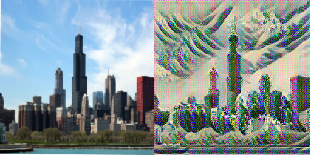

# Modern Tensorflow Fast Style Transfer

This code implements [Perceptual Losses for Real-Time Style Transfer and Super-Resolution](https://arxiv.org/abs/1508.06576) by Johnson and [Instance Normalization](https://arxiv.org/abs/1607.08022) by Ulyanov

Code is inspired by https://github.com/lengstrom/fast-style-transfer and improves it by using Tensorflow 2.0 modules and syntax, creating cleaner, more readable code, as well showing efficiency gains through more efficient training and data loading

There are still some bugs and it is a work in progress:

Result so far after training for approximately 3 hours on google cloud colab with the free GPU environment and applying the following style image:





There's still some error with high frequency artifacts left in the image that I'm debugging.

## Styling:

To style an image, run the following:

```
python src/style.py --content=path/to/content/image \
				--ckpt=path/to/model/checkpoint \
				--save-path=path/to/save/file
```

## Training

First run `setup.sh` to download the MS-COCO dataset to use for training. This can take a while as it is > 10 gb in size.

```
python src/train.py --style=path/to/style/image \
				--ckpt=path/to/model/checkpoint
```

Model checkpoint is optional and provided if you wish to continue training from beforer

This will also save model checkpoints during trraining every 100 steps to a auto-created `tf_ckpts` folder from which you can use checkpoints from

